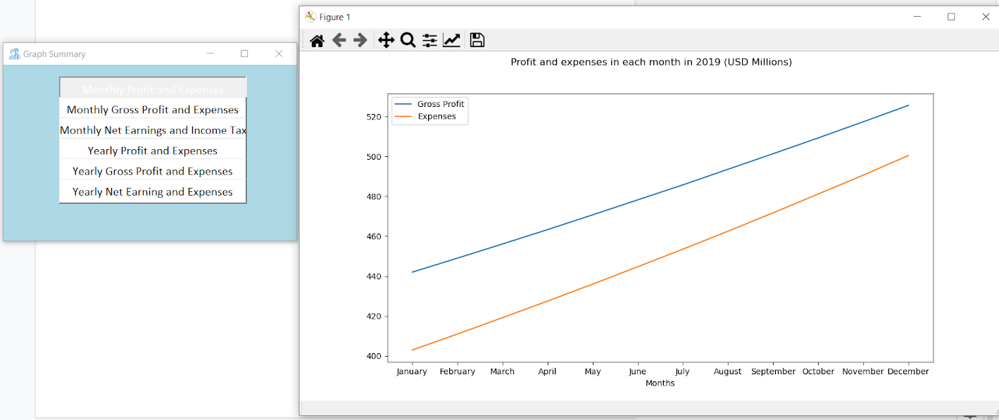

# payroll_system_using_python

Contributors:
    Jatin Chabbra
    Divyam Sharma
    Sneha Maiti

 #### The goal of this project is to make a Tkinter GUI for Managing PAYROLL SYSTEM.
 And To Visualize the Relationship among different components 
#### here are some Screenshots :
#### 1.Home Widget

#### 2.Add New Emp Widget

#### 3. Preview of Pay Slip

#### 4. Some Graphs

